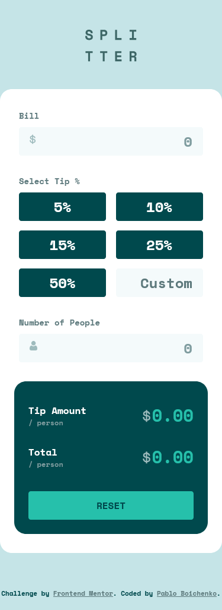

# Frontend Mentor - Tip calculator app solution

This is a solution to the [Tip calculator app challenge on Frontend Mentor](https://www.frontendmentor.io/challenges/tip-calculator-app-ugJNGbJUX). Frontend Mentor challenges help you improve your coding skills by building realistic projects.

## Table of contents

- [Overview](#overview)
  - [The challenge](#the-challenge)
  - [Screenshot](#screenshot)
  - [Links](#links)
- [My process](#my-process)
  - [Built with](#built-with)
- [Author](#author)
- [Acknowledgments](#acknowledgments)

## Overview

### The challenge

Users should be able to:

- View the optimal layout for the app depending on their device's screen size
- See hover states for all interactive elements on the page
- Calculate the correct tip and total cost of the bill per person

### Screenshot

 

### Links

- Solution URL: [https://github.com/PablinViking/Tip-calculator-app]

- Live Site URL: [https://pablinviking.github.io/Tip-calculator-app/]

## My process

### Built with

- Semantic HTML5 markup
- CSS custom properties
- Flexbox
- CSS Grid
- Mobile-first workflow
- BEM
- SASS

## Author

Website - [https://github.com/PablinViking]

Frontend Mentor - [https://www.frontendmentor.io/profile/PablinViking]

Instagram - [https://www.instagram.com/pabloboichenko/]

## Acknowledgments

I want to thank my teacher David Ruiz. Without him, I wouldn’t be on this path.

David Ruiz - [https://www.youtube.com/@CodingTube]
